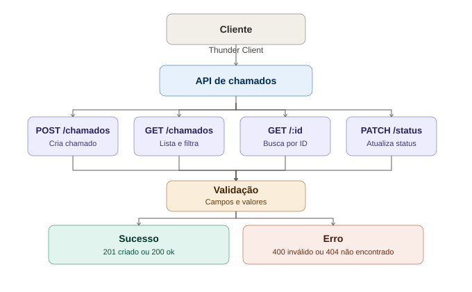

# API de Chamados de TI



API REST feita em Node.js e Express para registrar e acompanhar chamados de suporte de TI.
Os dados ficam guardados na memória do programa, ou seja, somem quando o servidor é reiniciado.

## Como executar

Pré-requisito: Node.js instalado.

```
npm install
node index.js
```

A API sobe em http://localhost:3000

## Status e prioridades aceitos

- Status: Aberto, Em atendimento, Resolvido
- Prioridade: Baixa, Media, Alta

## Endpoints

### Criar um chamado
POST /chamados
Body (JSON): titulo, descricao, solicitante, prioridade
Retorna 201 se criar. Retorna 400 se faltar campo ou a prioridade for inválida.

### Listar chamados
GET /chamados
Aceita filtros: /chamados?status=Aberto e/ou /chamados?prioridade=Alta

### Buscar um chamado pelo ID
GET /chamados/:id
Retorna 404 se o ID não existir.

### Atualizar o status
PATCH /chamados/:id/status
Body (JSON): status
Retorna 400 se o status for inválido. Retorna 404 se o chamado não existir.

## Como testar

Usei a extensão Thunder Client no VS Code para simular os pedidos HTTP.